Badanie wpływu zmiennych demograficznych na dochody w USA
================

O projekcie
===========

Źródło danych
-------------

Dane pochodzą z platformy Kaggle. Można je pobrać oraz uzyskać dostęp do dokładniejszego opisu zmiennych ze strony <https://www.kaggle.com/muonneutrino/us-census-demographic-data> (acs2015\_census\_tract\_data.csv).

Dane zawierają zmienne demograficzne amerykańskich jednostek administracyjnych dla 2015 roku. Podział administracyjny jest dokonany według amerykańskiego census tract. Jest to podział hrabstw na mniejsze obszary, stworzony w celu wydzielenia reprezentatywnych obszarów służących do spisu ludności. W poniższym projekcie zostaną one nazywane jednostkami administracyjnymi.

Cel
---

Celem projektu jest zbadanie wpływu zmiennych demograficznych na dochody ludności poprzez wizualizację zmiennych oraz budowę modeli predykcyjnych przewidujących wartości dochodów ludności jednostek administracyjnych.

Nacisk jest położony na interpretowalność wyników badań.

Dane
----

Zmienne wykorzystane w projekcie:

-   stopa bezrobocia,

-   liczba ludności,

-   płeć,

-   udział Latynosów,

-   udział Czarnoskórych,

-   udział Rdzennych mieszkańców,

-   udział Azjatów,

-   udział Białych,

-   udział zatrudnionych w usługach fachowych,

-   udział zatrudnionych w sektorze publicznym,

-   stan,

-   dochód.

``` r
#Ukrywanie powiadomień i ostrzeżeń
knitr::opts_chunk$set(warning = FALSE, message = FALSE)
```

``` r
#Wczytywanie bibliotek
library(tidyverse)
library(hexbin)
library(viridis)
library(rpart)
library(rpart.plot)
library(caret)

#Wczytywanie danych
data = read_csv('acs2015_census_tract_data.csv')
```

Transformacja danych
--------------------

Przeprowadzone zostaną:

-   wybór zmiennych demograficznych do dalszych analiz,

-   usunięcie danych z brakującym dochodem,

-   zmiana formatu dochodu na tysiące,

-   zmiana zmiennej określającej liczbę kobiet w procent kobiet w populacji.

``` r
data = data %>%
  select(c(Unemployment, TotalPop, Women, Hispanic,
           Black, Native, Asian, White, Professional,
           PublicWork, State, Income))

data =
  data %>%
  filter(is.na(Income) == FALSE)

data = 
  data %>%
  mutate(Income = (Income / 1000)) %>%
  rename('Income (in thousands)' = Income)

data = 
data %>%
  mutate(Women = round(Women * 100/TotalPop,2))
```

Wizualizacja zmiennych
======================

W tej sekcji zostanie przeprowadzona wizualizacja zmiennych demograficznych wraz z badaniem ich wpływu na dochody ludności.

Rozkład dochodu
---------------

Dochody ludności są zmienną zależną, a więc będziemy szukać wśród pozostałych cech takich, które mogą mieć wpływ na wartości tej zmiennej. Należy więc zwrócić uwagę na jej strukturę.

``` r
data %>%
  ggplot(aes(`Income (in thousands)`)) +
  geom_histogram(binwidth = 10, fill = 'darkblue', colour = 'white')
```


``` r
data$`Income (in thousands)` %>%
  summary()
```

    ##    Min. 1st Qu.  Median    Mean 3rd Qu.    Max. 
    ##   2.611  37.683  51.094  57.226  70.117 248.750

Dochody ludności oscylują głównie w granicach 38-70 tysięcy dolarów (połowa wszystkich wartości zmiennej).

Dla dochodów do 80 tysięcy można zaobserwować rozkład zbliżony do normalnego, jednak wyższe poziomy dochodu wskazują na prawosstronną asymetrię. Warto przyjrzeć się bliżej również tym wyższym wartościom.

Stopa bezrobocia
----------------

Dochód mieszkańców powinien być silnie skorelowany ze stopą bezrobocia. Przekonajmy się jak to wygląda w rzeczywistości.

``` r
data %>%
  ggplot(aes(`Income (in thousands)`, Unemployment)) +
  geom_point(alpha = 0.4)
```

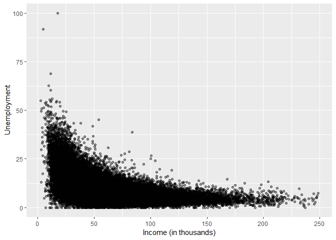

Jak można było przypuszczać, jednostki administracyjne z wyższą stopą bezrobocia charakteryzują się niższymi zarobkami. Zdecydowanie niższy dochód można zaobserwować dla jednostek z wysoką stopą bezrobocia.

Wykres nie jest jednak liniowy, więc oznacza to, że zmienne nie są ze sobą w pełni skorelowane. Można dostrzec przy wartościach dochodu powyżej 150 tysięcy również wartości z nieznacznie wyższą stopą bezrobocia.

Wydaje się jednak, że powinna to być jedna z najważniejszych charakterystyk w przewidywaniu dochodów ludności.

Liczba ludności
---------------

``` r
data %>%
  ggplot(aes(`Income (in thousands)`, TotalPop)) +
  geom_point(alpha = 0.2)
```

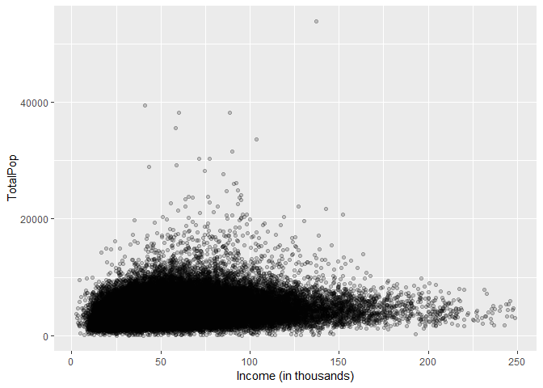

Wielkość populacji jednostek administracyjnych nie wydaje się być skorelowana z dochodem. Można jednak zauważyć, że wyższy dochód występuje jedynie w jednostkach o niewielkiej liczbie mieszkańców. Można przypuszczać, że bogatsi ludzie wolą się osiedlać w mniejszych, odosobnionych obszarach.

Udział kobiet w populacji
-------------------------

``` r
data %>%
  ggplot(aes(`Income (in thousands)`, Women)) +
  geom_point()
```

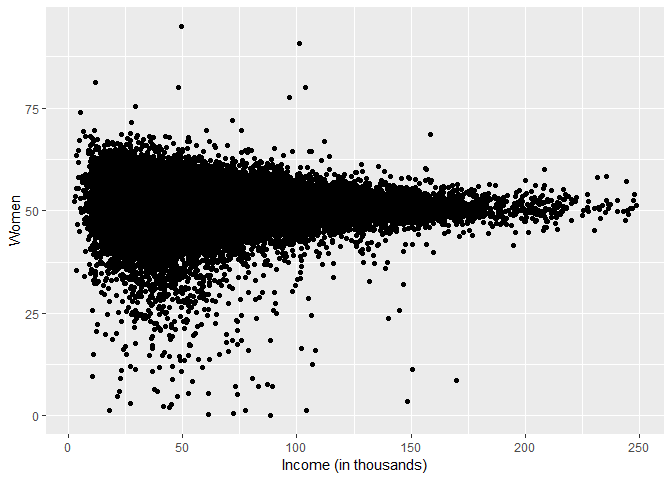

Jak wynika z wykresu, nie można dostrzec wyraźnej korelacji między płcią a dochodem. Występuje sporo obserwacji odstających dla mniejszego udziału kobiet w populacji, jednak nie wskazują one żadnego określonego trendu.

Kolor skóry
-----------

``` r
data %>%
  ggplot(aes(`Income (in thousands)`, Hispanic)) +
  geom_hex(bins = 15, colour = 'white') +
  scale_fill_viridis() +
  ggtitle('Latynosi')
```

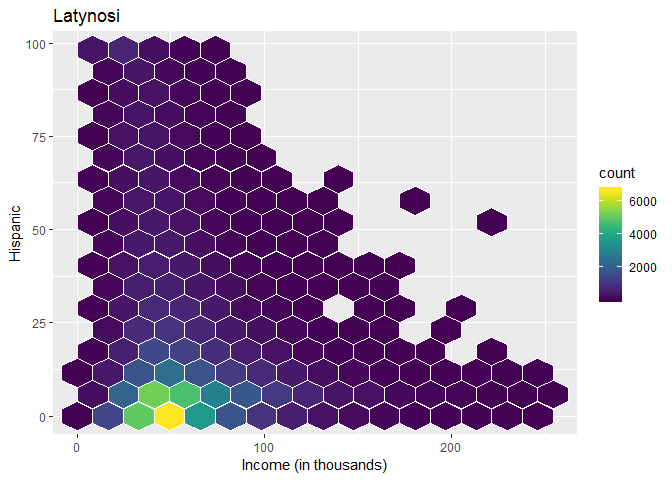

``` r
data %>%
  ggplot(aes(`Income (in thousands)`, Black)) +
  geom_hex(bins = 15, colour = 'white')+
  scale_fill_viridis() +
  ggtitle('Czarnoskórzy')
```

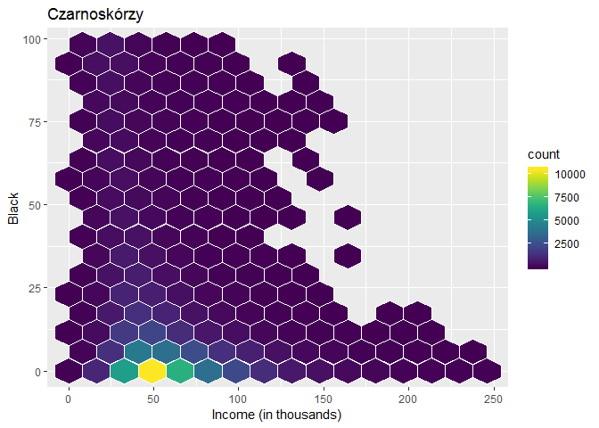

Nie ma wyraźnej korelacji między zmiennymi a dochodem. Można jednak zaobserwować, że wyższe wartości dochodów występują na obszarach, w których udział Latynosów i Czarnoskórych jest niewielki.

``` r
data %>%
  ggplot(aes(`Income (in thousands)`, Native)) +
  geom_hex(bins = 15, colour = 'white') +
  scale_fill_viridis() +
  ggtitle('Rdzenni mieszkańcy')
```


Wykres wskazuje prawidłowość, że dochody powyżej 120 tysięcy występują jedynie na obszarach, gdzie populacja rdzennych mieszkańców stanowi mniej niż 10% całości.

Najwyższe zarobki występują tam, gdzie nie mieszkają rdzenni mieszkańcy.

``` r
data %>%
  ggplot(aes(`Income (in thousands)`, Asian)) +
  geom_hex(bins = 15, colour = 'white') + 
  scale_fill_viridis() +
  ggtitle('Azjaci')
```

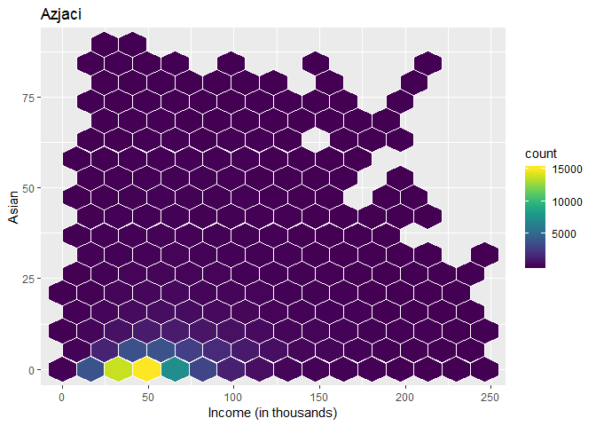

Udział Azjatów jest rozrzucony w różnych obszarach dochodów, więc nie jest to dobra zmienna determinująca dochody ludności.

``` r
data %>%
  ggplot(aes(`Income (in thousands)`, White)) +
  geom_hex(bins = 15, colour = 'white') +
  scale_fill_viridis() +
  ggtitle('Biali')
```

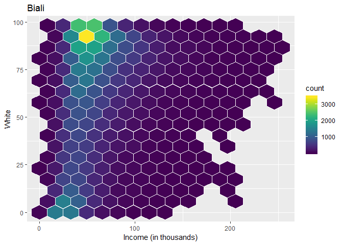

Wykres wskazuje, że wyższe dochody występują w miejscach gdzie jest więcej ludności Białej. Można jednak zaobserwować załamanie się tej tendencji, gdy stanowią oni niemalże całość populacji.

Dochody w granicach 200 tysięcy występują także dla jednostek administracyjnych, w których ludność Biała stanowi nawet jedynie około 10% całości. Można to uznać za kolejne odstępstwo od ogólnego trendu.

Zmienna ma pewien wpływ na dochód, jednak przy budowie modelu predykcyjnego należy również zwrócić uwagę, czy został odpowiednio uwzględniony wpływ odstępstw od reguły.

Usługi fachowe
--------------

``` r
data %>%
  ggplot(aes(`Income (in thousands)`, Professional)) +
  geom_point()
```

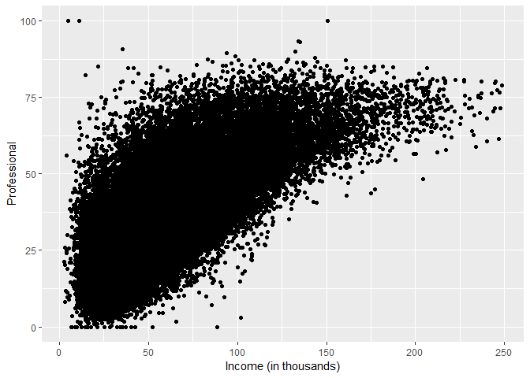

Można zaobserwować wyraźny trend: im więcej osób pracuje w usługach fachowych, tym większe dochody ludności. Jest to zmienna, która w bardzo dużym stopniu powinna wpływać na dochody ludności.

Sektor publiczny
----------------

``` r
data %>%
  ggplot(aes(`Income (in thousands)`, PublicWork)) +
  geom_point(alpha = 0.3)
```

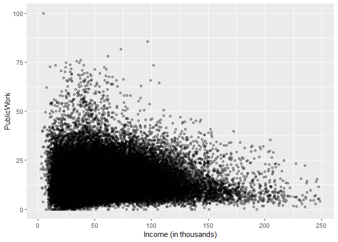

Badając wykres można dopatrzyć się pewnego trendu, ukazującego wzrost dochodów przy spadku udziału osob zatrudnionych w sektorze publicznym. Jednak także w jednostkach z niewielkim udziałem zatrudnienia w sektorze publicznym występują niskie dochody. Dodatkowo istnieje sporo obserwacji odstająych. Praca w sektorze publiczym może mieć pewien wpływ na dochody, jednak nie powinien on być zbyt duży.

Stany według poziomu dochodów
-----------------------------

``` r
States = 
data %>%
  group_by(State) %>%
  summarise(Income = median(`Income (in thousands)`)) %>%
  arrange(desc(Income))

States = States$State

data$State =
  factor(data$State, levels = States)

States_higher =
States %>%
  head(3)

States_lower =
States %>%
  tail(3)

States = 
  union(States_higher, States_lower)

data %>%
  filter(State %in% States) %>%
  ggplot(aes(State, `Income (in thousands)`)) +
  geom_boxplot()
```

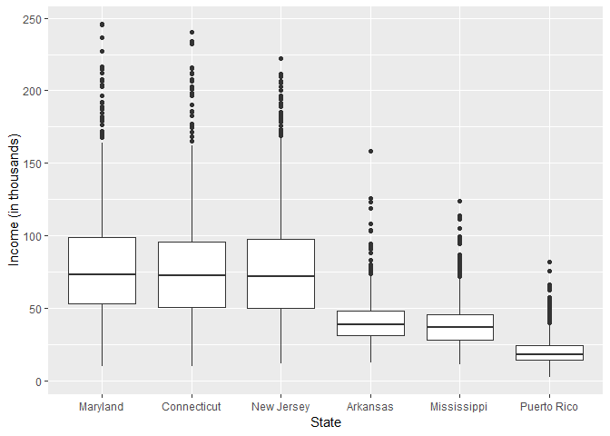

Zostały wybrane po 3 stany z największą i najmniejszą medianą zarobków, aby móc następnie porównać, jakie wartości przyjmują wybrane zmienne dla stanów z krańcowymi poziomami dochodów.

Jak widać na wykresie, stany powinny być dobrym wyznacznikiem poziomu dochodu. Poziom dolnych kwartyli z lewej części wykresu jest ponad poziomem kwartyli górnych z prawej części, a więc ponad 75% wartości dochodów regionów z mniejszym dochodem znajduje się w przedziale 25% wartości z najniższym dochodem dla regionów z wyższym dochodem.

Udział zatrudnionych w usługach fachowych oraz stopa bezrobocia według stanów
-----------------------------------------------------------------------------

``` r
data %>%
  filter(State %in% States) %>%
  ggplot(aes(Unemployment, Professional)) +
  geom_point(alpha = 0.4) +
  facet_wrap(~State)
```

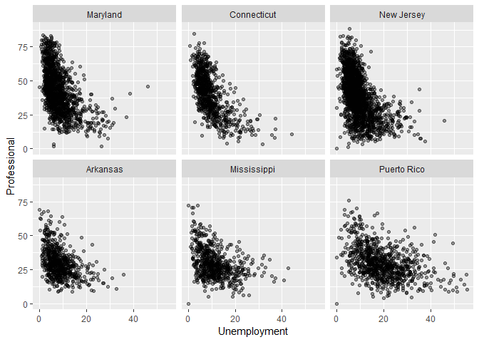

Wykres przedstawia wartości udziału zatrudnionych w usługach fachowych oraz stopy bezrobocia w danych regionach.

Na wykresie można zauważyć całkiem spory udział osób zatrudnionych w usługach fachowych dla stanów z wysokim dochodem (górna część wykresu), w przeciwieństwie do regionów z najmniejszymi dochodami (dolna część wykresu). Zagęszczenie obserwacji z udzialem zatrudnionych w usługach fachowych występuje dopiero w granicach 50% dla regionów z niższym dochodem, przy wartości w granicach 75% dla stanów z wyższym dochodem.

Stopa bezrobocia jednakże nie różni się tak bardzo między regionami z wysokim i niskim dochodem. Można się dopatrzyć prawidłowości, że nasilenie się liczby obserwacji znajduje się dla regionow z wysokim dochodem dla nieznacznie niższej stopy bezrobocia, niż dla regionów z niskim dochodem, jednak nie są to istotne różnice.

Udział zatrudnionych w usługach fachowych wydaje się mieć większy wpływ na dochod niż stopa bezrobocia.

Budowa modeli drzew decyzyjnych
===============================

Na podstawie zmiennych zaprezentowanych w poprzedniej części projektu zostanie przeprowadzona budowa modeli drzew decyzyjnych, przewidujących wartości dochodów dla jednostek administracyjnych.

Zmienna określająca stany nie zostanie uwzlędniona w predykcji, gdyż w poprzedniej części posłużyły one za wyznacznik dochodów.

Zbiór danych zostanie podzielony w sposób losowy na dane treningowe (70% całości), na podstawie których model będzie budował reguły oraz na zbiór testowy (30% całości), sprawdzający jak dobrze otrzymane reguły są zgeneralizowane dla nowych danych.

``` r
data = data %>%
  select(-State)

set.seed(63)
train = data %>%
  sample_frac(0.7)

test = data %>%
  anti_join(train)
```

Drzewo decyzyjne
----------------

Drzewo decyzyjne przedstawia się następująco:

``` r
train = train %>%
  na.omit()

model = rpart(`Income (in thousands)` ~ . , data = train)
rpart.plot(model)
```

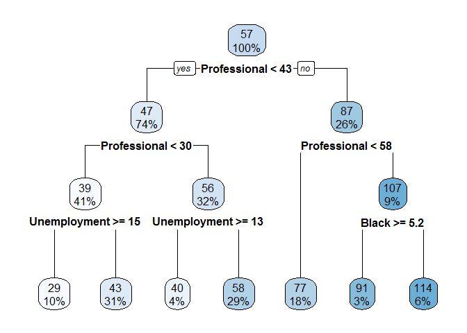

Zdecydowanie najważniejszą zmienną determinującą wartość dochodu w drzewie decyzyjnym okazał się być udział zatrudnionych w usługach fachowych. Pojawia się on w 3 z 6 podziałów drzewa, w tym w trzech pierwszych. Domniemania z wcześniejszej wizualizacji zmiennych znajdują więc odzwierciedlenie w modelu.

Stopa bezrobocia także została wcześniej uznana za jedną z najważniejszych zmiennych wpływających na wartość dochodu.

Algorytm, do podziału drzewa, wybrał także udział ludności Czarnoskórej w całości populacji jednostek administracyjnych. Sprawdźmy, czy takie postępowanie powinno przynieść modelowi lepszą skuteczność. Zwizualizujmy więc udział Czarnoskórych w stosunku do dochodów, z uwzględnieniem również reguł z poprzednich gałęzi (udział zatrudnionych w usługach fachowych większy lub równy 58%). Zmniejszmy także przedział udziału ludności Czarnoskórej do maksymalnie 50%. Nie ma wiele obserwacji przekraczających tę wartość, a czytelność wykresu będzie znacznie lepsza.

Wizualizacji na wykresach będziemy dokonywać już oddzielnie dla zbioru treningowego oraz testowego. Dla zbioru treningowego, gdyż to na podstawie obserwacji w nim zawartych jest budowany model. Zbiór testowy z kolei może poslużyć do zbadania, czy reguły występujące w modelu nie są przeuczone do zbioru treningowego.

``` r
train %>%
  filter(Professional >=58 & Black <=50) %>%
  ggplot(aes(Black, `Income (in thousands)`)) +
  geom_point(alpha = 0.5) +
  ggtitle('Czarnoskórzy a dochód w zbiorze treningowym')
```

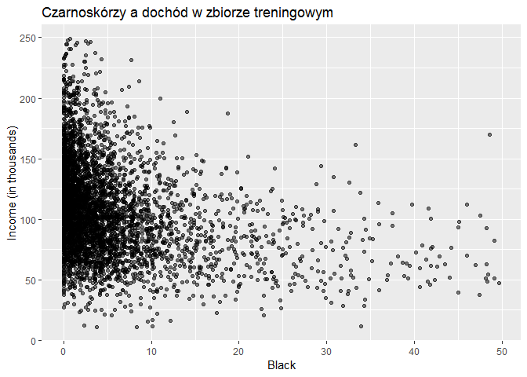

``` r
test %>%
  filter(Professional >=58 & Black <=50) %>%
  ggplot(aes(Black, `Income (in thousands)`)) +
  geom_point(alpha = 0.5) +
  ggtitle('Czarnoskórzy a dochód w zbiorze testowym')
```

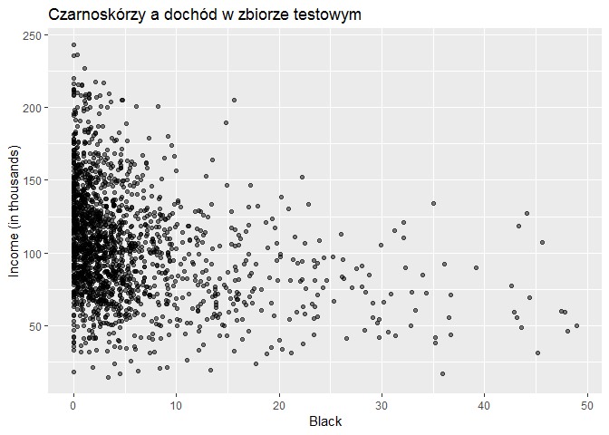

Według naszego modelu, jeśli udział ludności Czarnoskórej wynosi przynajmniej 5.2%, oznacza to spadek wartości dochodów o ponad 20 tysięcy dolarów. Z wykresu można faktycznie zauważyć, że dla większych wartości udziału Czarnoskórych, odsetek wartości nieprzekraczających 75 tysięcy dolarów jest znacznie wyższy niż dla wartości o mniejszym udziale.

Można więc stwierdzić, że pomimo dość dużych rozbieżności dochodów dla danego udziału ludności Czarnoskórej, zmienna powinna pomóc w lepszej efektywności modelu.

Wizualizacja zmiennych w zbiorze testowym również zawiera tę prawidłowość, więc model nie wygląda na przeuczony.

Pomiar efektywności modelu
--------------------------

``` r
pred = predict(model, test) 
pred = cbind(pred, Income = test$`Income (in thousands)`)
RMSE(pred[2], pred[1])
```

    ## [1] 15.0011

RMSE dla modelu dla zbioru testowego przyjmuje wartość około 15. Oznacza to, że prognozowane wartości dochodów odchylają się średnio o 15 tysięcy dolarów od wartości rzeczywistych. Jako, że połowa wartości dochodów oscyluje w przedziale 38-70 tysięcy dolarów, wynik ten nie jest do końca satysfakcjonujący.

Głębsze drzewo decyzyjne
------------------------

Aby uzyskać lepsze wyniki predykcji, zostanie zbudowany model z większym parametrem złożoności drzewa.

``` r
model = rpart(`Income (in thousands)` ~ . , data = train, cp = 0.0025)
rpart.plot(model)
```

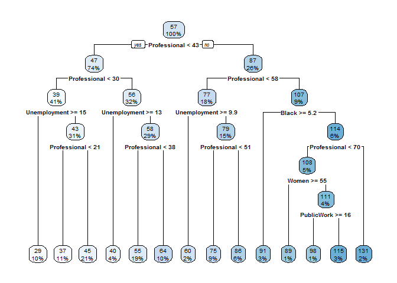

``` r
pred = predict(model, test) 
```

Oprócz podziałów gałęzi, jakie można bylo zauważyć w poprzednim modelu, pojawił się także nowy podział stopy bezrobocia. Powstały również kolejne podziały ze względu na poziomy udziału zatrudnionych w usługach fachowych. Model więc kontynuował podział drzewa na kolejne gałęzie, zwiększając jedynie czułość modelu na najważniejsze zmienne. Powinno to pomóc w dokładniejszym oszacowaniu wartości dochodów.

Dodatkowo, dla ścieżki prowadzącej do udziału ludności Czarnoskórej, nastąpił kolejny podział ze względu na zatrudnionych w usługach fachowych, a następnie podział ze względu na płeć. Z kolei od niego poprowadzono kolejny węzeł prowadzący do podziału drzewa ze względu na udział zatrudnionych w sektorze publicznym.

Płeć w naszej wstępnej wizualizacji nie została uznana za istotną zmienną. Udział zatrudnionych w sektorze publicznym z kolei charakteryzował się pewnym trendem, jednak także sporą liczbą obserwacji odstających. Zbadajmy więc, jak wyglądają zależności między zmiennymi a dochodem dla tej ścieżki. Ograniczmy udział kobiet do przedziału 40-60% dla lepszej widoczności.

``` r
train %>%
  filter(Professional >=58 & Professional < 70 & Black < 5.2, 
         Women >= 40 & Women <= 60) %>%
  ggplot(aes(Women, `Income (in thousands)`)) +
  geom_point() +
  ggtitle('Udział kobiet a dochód w zbiorze treningowym')
```

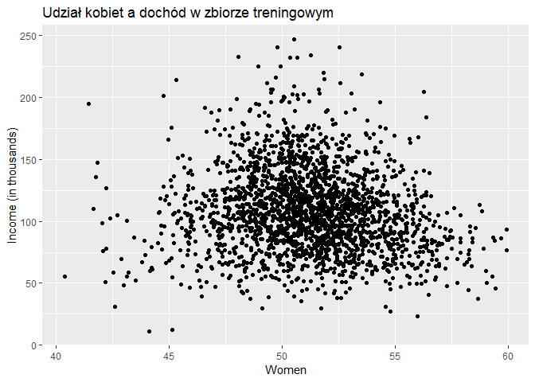

``` r
test %>%
  filter(Professional >=58 & Professional < 70 & Black < 5.2, 
         Women >= 40 & Women <= 60) %>%
  ggplot(aes(Women, `Income (in thousands)`)) +
  geom_point() +
  ggtitle('Udział kobiet a dochód w zbiorze testowym')
```

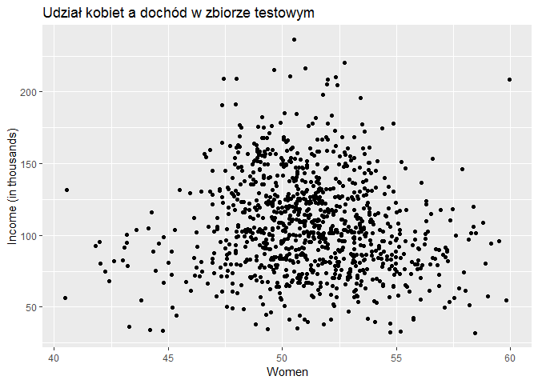

Granicą podziału drzewa był udział kobiet w ludności wynoszący 55%. Wartości mniejsze oznaczają większy dochód. Z wykresu nie wynikają szczególnie duże zależności między zmiennymi. Dla poziomu powyżej 55% dochód faktycznie jest trochę mniejszy niż przy niższych wartościach, jednak już przy 45% udziału kobiet i niżej wartości te prezentują się bardzo podobnie.

Zbiór testowy jest analogiczny do zbioru treningowego.

Zbadajmy teraz, jak wyglądają obserwacje dla kolejnego podziału drzewa. Dla lepszej przejrzystości ograniczmy udział zatrudnionych w sektorze publicznym do 40%.

``` r
train %>%
  filter(Professional >=58 & Professional < 70 & Black < 5.2 & 
         Women < 55 & PublicWork <= 40) %>%
  ggplot(aes(PublicWork, `Income (in thousands)`)) +
  geom_point(alpha = 0.8) +
  ggtitle('Udział zatrudnionych w sektorze publicznym a dochód w zbiorze treningowym')
```

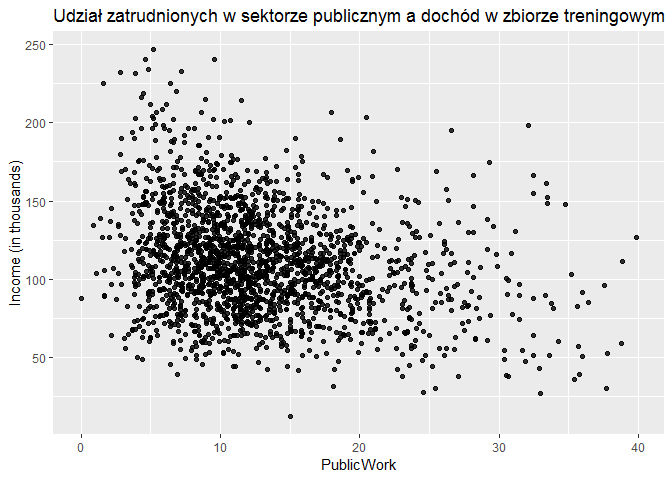

``` r
test %>%
  filter(Professional >=58 & Professional < 70 & Black < 5.2 & 
         Women < 55 & PublicWork <= 40) %>%
  ggplot(aes(PublicWork, `Income (in thousands)`)) +
  geom_point(alpha = 0.8) +
  ggtitle('Udział zatrudnionych w sektorze publicznym a dochód w zbiorze testowym')
```

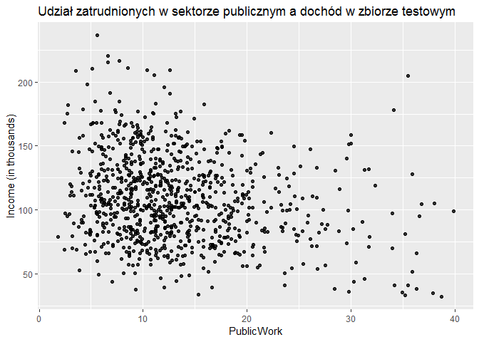

Udział zatrudnionych w sektorze publicznym poniżej 16% ma gwarantować wyższe dochody. Wykres wciąż, tak jak w części wizualizacji zmiennych, wskazuje na trend zniżkowy. Pomimo wielu obserwacji odstających można stwierdzić, że taki podział drzewa może przynieść korzyści w prognozowaniu dochodów, jednak nie jest to już tak oczywiste.

Dużą rolę w doprowadzeniu do takiej sytuacji może odgrywać mała liczba jednostek administracyjnych z wysokim odsetkiem zatrudnionych w sektorze publicznym. Tak mała liczba obserwacji może skutkować w nagromadzeniu się wartości, które nie odzwierciedlają rzeczywistośći. Zbiór testowy jednak potwierdza trend występujący w zbiorze treningowym.

Pomiar efektywności modelu
--------------------------

``` r
pred = cbind(pred, Income = test$`Income (in thousands)`)

RMSE(pred[2], pred[1])
```

    ## [1] 9.268308

RMSE dla drugiego modelu wyniósł trochę ponad 9. Oznacza to, że wartości dochodu odchylały się przeciętnie o prawie 6 tysięcy mniej niż w prostszym modelu. Wynik jest więc lepszy o około 40%.

Wnioski
-------

Nie można jednoznacznie stwierdzić, który z modeli jest lepszy. Pierwszy, mniej skomplikowany, dostarcza bardziej przejrzyste reguły. Ich wizualizacja zdecydowanie potwierdza zachodzące wśród nich relacje.

Z drugiej jednak strony, drugi model zapewnia większą efektywność, jednak zależności w nim występujące nie są już tak oczywiste.

Podsumowanie
============

Badanie wpływu zmiennych demograficznych na dochody ludności w jednostkach administracyjnych w USA zostało w pełni przeprowadzone.

Proces objął wizualizację zmiennych i badanie ich korelacji z dochodami wraz z interpretacją otrzymanych wyników.

Następnie został zastosowany algorytm drzew decyzyjnych, który umożliwił predykcję wartości dochodów dla danych jednostek administracyjnych. Zbudowano 2 modele, jeden mniej, drugi bardziej skomplikowany. Zostala podjęta również próba wizualizacji reguł decyzyjnych.

Zmiennymi demograficznymi mającymi największy wpływ na dochody jednostek administracyjnych w USA okazały są przede wszystkim:

-   udział zatrudnionych w usługach fachowych,

-   stopa bezrobocia.
